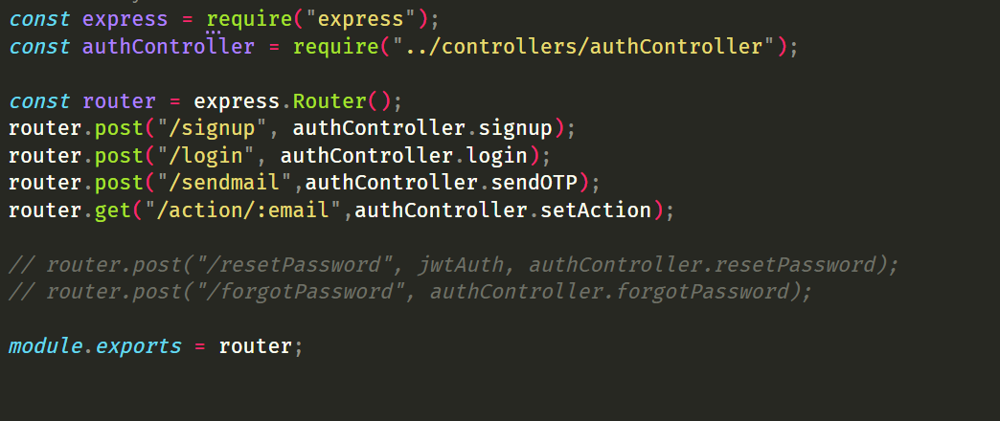
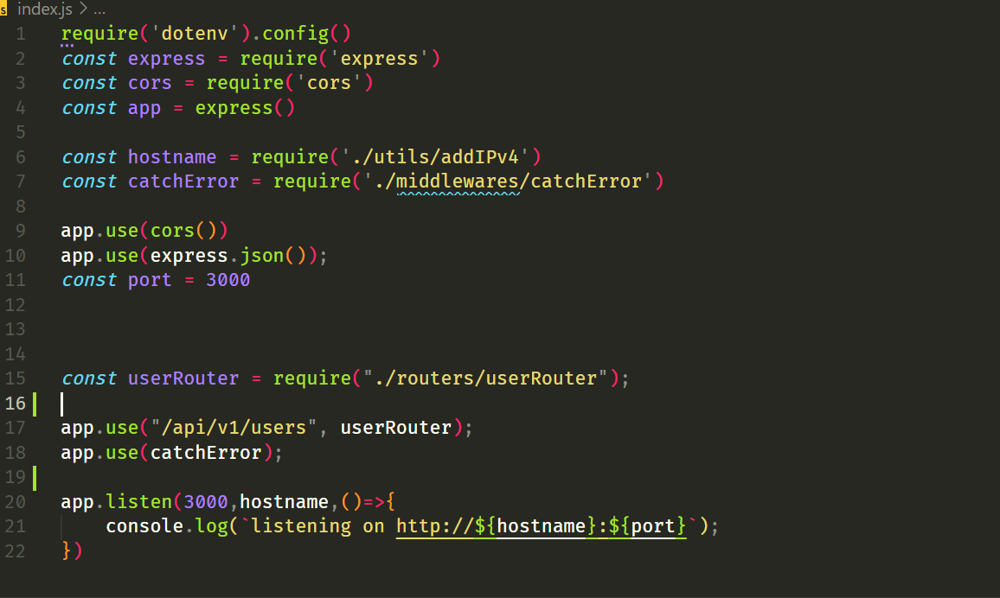
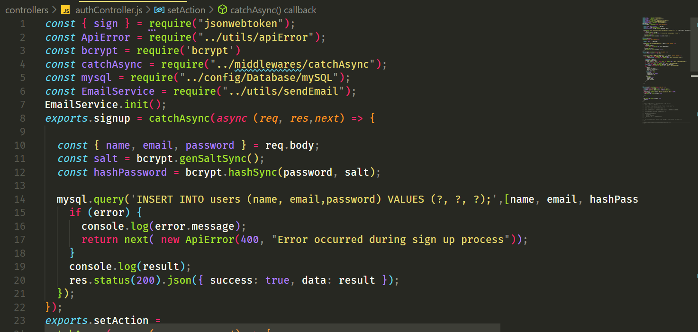
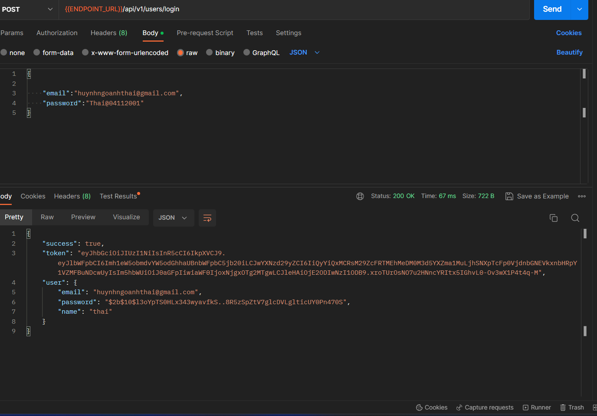
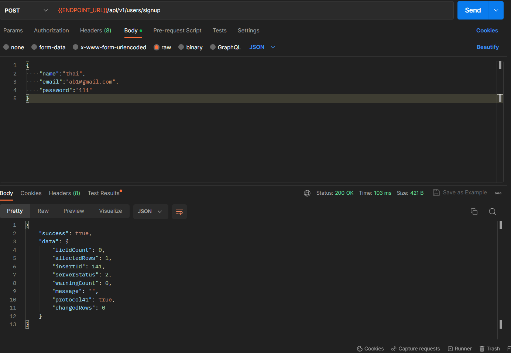
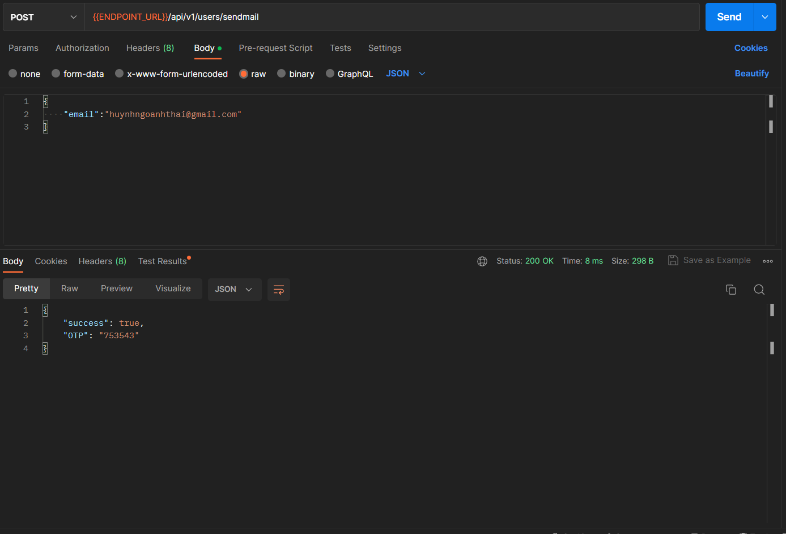
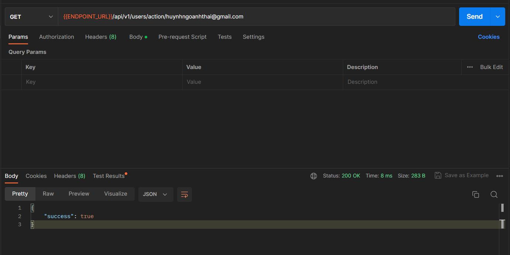
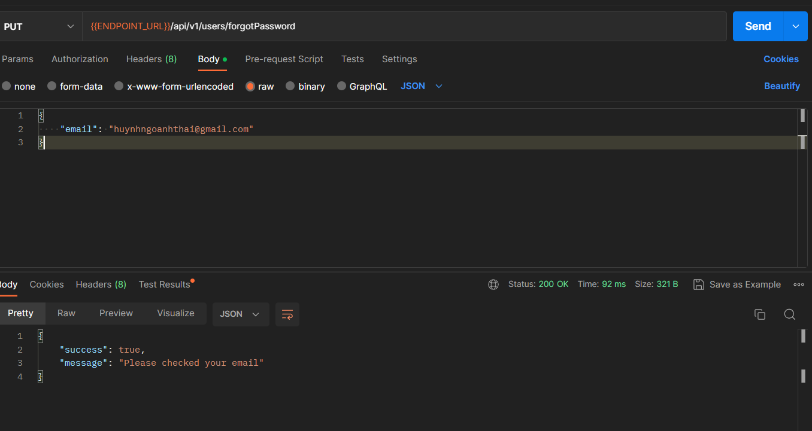

# [**Table Of Content**](#table-of-content)
- [**Table Of Content**](#table-of-content)
- [**Introduction**](#introduction)
- [**Rules**](#rules)
  - [**1. Method**](#1-method)
  - [**2. Direction**](#2-direction)
  - [**3. Code**](#3-code)
- [**Document**](#document)
  - [**1. Authentication**](#1-authentication)
  
    - [**🟡 1. Login**](#1-login)
    - [**🟡 2. Sign Up**](#2-sign-up)
    - [**🟡 3. send mail**](#3-send-mail)
    - [**🟢 4. action user**](#4-action)
    - [**🟠 5. forgot Password**](#5-forgotpassword)
    
# [**Introduction**](#introduction)

Đây là tài liệu mô tả chi tiết từng API được mình - Huỳnh Ngô Anh Thái - viết và chuẩn bị trong đồ án.
Mình làm cái này để lưu lại cho mục đích liệt kê các chức năng mình đã làm. Đồng thời, đây là đồ án
của mình nên mình muốn hoàn thiện ở mức đồ tốt nhất có thể.

# [**Rules**](#rules)

## [**1. Method**](#1-method)

API của mình viết theo chuẩn Restful API, trong đồ án của mình thì mình chỉ sử dụng 5 dạng phương thức quen thuộc 
sau để xây dựng đồ án:

- 🟢 **GET** - Để truy xuất một tài nguyên. Ví dụ: lấy thông tin 1 giao dịch thì dùng phương thức GET

- 🟡 **POST** - Để tạo một tài nguyên trên máy chủ. Ví dụ: tạo mới một tài khoản

- 🔵 **PUT** - Để thay đổi trạng thái toàn bộ một tài nguyên hoặc để cập nhật nó. Ví dụ: thay đổi mật khẩu, tên hiển thị

- 🟠 **PATCH** - Giống PUT nhưng PATCH thường dùng trong trường hợp sửa 1 phần của tài nguyên.

- 🔴 **DELETE** - Để huỷ bỏ hoặc xoá một tài nguyên. Ví dụ: xóa hoàn toàn một thể loại, bài viết,...

Hãy để ý một chút tới màu sắc mà mình quy ước bên trên. Mình sẽ sử dụng màu sắc kết hợp với các thông tin khác
để mô tả API.

## [**2. Direction**](#2-direction)

Để xem toàn bộ các điều hướng khi một API được gọi. Hãy mở `router/userRouter.js` - đây là tệp tin chứa 
điều hướng & xử lý khi một API được gọi.

    

<h3 align="center">

***Hình ảnh các API được khai báo trong tệp tin userRouter.js***
</h3>

Giả sử, mình lấy ví dụ một dòng cho dễ hiểu nha 😅

> router.post("/login", authController.login);

Trong này, cấu trúc mặc định câu lệnh là

> router."ác phương thức hỗ trợ"("tên đường dẫn", "Controller sẽ xử lý yêu cầu");

Vậy thì với ví dụ trên thì 

- `POST` là các phương thức hỗ trợ

- `/login` là tên đường dẫn của API. Ví dụ như: GET - http://${hostname}:${port}/api/v1/users sẽ là một yêu cầu hợp lệ

- `authController.login` là controller xử lý yêu cầu này.

lưu ý:
địa trị mình setup bản đầu cho url "http://${hostname}:${port}/api/v1/users"
tứ là nếu mình gọi phương thức login sẽ là 😅

> POST http://${hostname}:${port}/api/v1/users/login

    

<h3 align="center">

## [**3. Code**](#3-code)

Các mình viết hàm xử lý là đồng nhất và xuyên suốt toàn bộ các controller nên mình sẽ mô tả tóm gọn 
như sau:

    

<h3 align="center">

***Cấu trúc mặc định của một Controller***
</h3>
Từ hình minh họa bên trên, chúng ta có thể hiểu được cấu trúc một Controller trong đồ án này. 

ta sử dung `req.body` để nhận giá trị từ boby gửi lên rồi sao đó sử dung `mysql.query` để truy vấn vào cơ sở dữ liệu

nêu có lỗi thì chương trịnh sẽ chạy hàm `next` rồi sẽ đươc `middleware` sử lý lỗi 

nêu hoàn thành thành công thì `res.status(200).json({ success: true, data: result });` trả về một json với status code thành công

# [**Document**](#document)

Phần này mình sẽ mô tả chi tiết từng API, đối số truyền vào là gì và kết quả trả về.

## [**1. Authentication**](#1-authentication)

Mục đích chung là phục vụ chức năng đăng nhập & xác thực danh tính người dùng. Bất kì ai cũng có thể sử dụng API này.
Trong API mình có sử dụng chức năng Variable của POSTMAN để tiết kiệm thời gian viết code. Tên & ý nghĩa của chúng như sau:

| Tên                   | Chức năng                                                                         |
|-----------------------|-----------------------------------------------------------------------------------|
| ENDPOINT_URL          | Tên đường dẫn chung của đồ án - http://{hostname}:{post}  |

để biết được hostname bạn sự dụng lệnh trong cmd:
> ipconfig
sao đo tìm dòng 
>  IPv4 Address. . . . . . . . . . . : 192.168...
đó là hostname của bạn 

### [**🟡 1. Login**](#1-login)

- **Purpose**: Xử lý yêu cầu đăng nhập của user từ Android gửi tới.

- **Permission**: ADMIN - SUPPORTER - USER

- **Method**: 🟡 **POST**

- **URL**: {{ENDPOINT_URL}}/api/v1/users/login

- **Headers**: bỏ trống

- **Body**:
  
    | Tên                   | Tùy chọn | Ý nghĩa                                                                           |
    |-----------------------|----------|-----------------------------------------------------------------------------------|
    | Email                 | Bắt buộc | Email đăng ký tài khoản                                                            |
    | Password              | Bắt buộc | Mật khẩu tài khoản                                                                 |

- **Respone**:

    

<h3 align="center">

### [**🟡 2. Sign Up**](#2-sign-up)

- **Purpose**: Xử lý yêu cầu đăng ký của user từ Android gửi tới.

- **Permission**: ADMIN - SUPPORTER - USER

- **Method**: 🟡 **POST**

- **URL**: {{ENDPOINT_URL}}/api/v1/users/signup

- **Headers**: bỏ trống

- **Body**:
  
    | Tên                   | Tùy chọn | Ý nghĩa                                                                           |
    |-----------------------|----------|-----------------------------------------------------------------------------------|
    | name                  | Bắt buộc | name đăng ký tài khoản                                                            |
    | Email                 | Bắt buộc | Email đăng ký tài khoản                                                           |
    | Password              | Bắt buộc | Mật khẩu tài khoản                                                                |
    

- **Respone**:

    

<h3 align="center">

### [**🟡 3. Send Mail**](#3-send-mail)

- **Purpose**: Xử lý yêu cầu gửi otp qua email của user từ Android gửi tới.

- **Permission**: ADMIN - SUPPORTER - USER

- **Method**: 🟡 **POST**

- **URL**: {{ENDPOINT_URL}}/api/v1/users/sendmail

- **Headers**: bỏ trống

- **Body**:
  
    | Tên                   | Tùy chọn | Ý nghĩa                                                                           |
    |-----------------------|----------|-----------------------------------------------------------------------------------|
    | Email                 | Bắt buộc | Email đăng ký tài khoản                                                           |
    

- **Respone**:

    

<h3 align="center">

### [**🟢 4. action user**](#4-action)

- **Purpose**: Xử lý yêu cầu gửi action của user từ Android gửi tới.

- **Permission**: ADMIN - SUPPORTER - USER

- **Method**: 🟢 **GET**

- **URL**: {{ENDPOINT_URL}}/api/v1/users/action/:email

- **Headers**: bỏ trống

- **Body**:  bỏ trống
  
- **Respone**:

    

<h3 align="center">

### [**🟠 4. forgot password**](#4-forgotpassword)

- **Purpose**: Xử lý yêu cầu gửi quên mật khẩu của user từ Android gửi tới.

- **Permission**: ADMIN - SUPPORTER - USER

- **Method**: 🟠 **PATCH**

- **URL**: {{ENDPOINT_URL}}/api/v1/users/action/:email

- **Headers**: bỏ trống

- **Body**: 
 
    | Tên                   | Tùy chọn | Ý nghĩa                                                                           |
    |-----------------------|----------|-----------------------------------------------------------------------------------|
    | Email                 | Bắt buộc | Email đăng ký tài khoản                                                           |
  
- **Respone**:

    

<h3 align="center">
